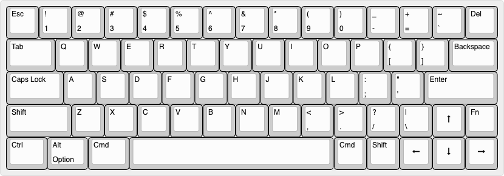
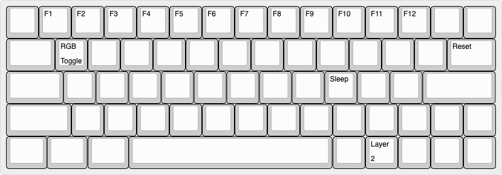
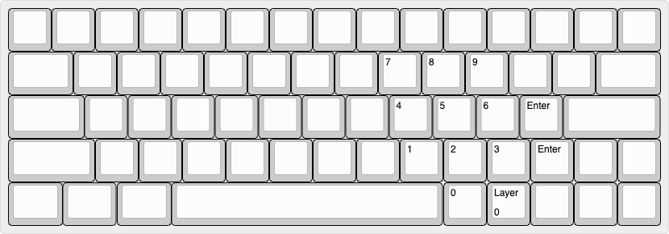

# robin-QMK
This is firmware for my keyboard that uses a DZ60 PCB.

## Layout Image
### Layer 0 (Default)

### Layer 1 (Function)

### Layer 2 (Numpad)

## Known issues:
- Need to test whether transparency works properly on layers 1 and 2
